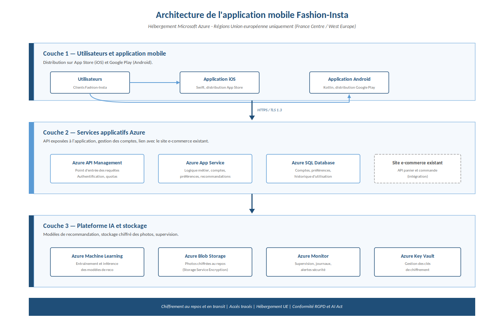

# Cadrage projet — Application mobile IA Fashion-Insta

Cadrage d'un projet IA pour le compte d'une entreprise de prêt-à-porter (cas fictif).
L'application mobile recommande des articles vestimentaires à partir des photos
prises par l'utilisateur et de ses préférences déclarées.

Ce dépôt contient l'ensemble des livrables produits pendant la phase de cadrage :
backlog, dimensionnement, registre des traitements RGPD, analyse des risques,
support de présentation pour le comité exécutif, et schéma d'architecture.

---

## Aperçu de l'architecture



Application mobile distribuée sur iOS et Android, services applicatifs Azure
en région Union européenne, et plateforme IA dédiée pour les modèles de
recommandation. Chiffrement de bout en bout, conformité RGPD et AI Act.

---

## Livrables

| Fichier                                                        | Contenu                                                                                                                                                                           |
| -------------------------------------------------------------- | --------------------------------------------------------------------------------------------------------------------------------------------------------------------------------- |
| [`01_backlog_user_stories.xlsx`](01_backlog_user_stories.xlsx) | 16 user stories priorisées MoSCoW, avec pondération en points et charge en "jours-homme".                                                                                         |
| [`02_tableur_cadrage.xlsx`](02_tableur_cadrage.xlsx)           | 5 onglets : dimensionnement (équipe, coûts, rentabilité 5 ans), planning des sprints, registre CNIL des traitements, fiche détaillée du traitement sensible, analyse des risques. |
| [`03_presentation_comex.pptx`](03_presentation_comex.pptx)     | Support de présentation                                                                                                                                                           |
| [`04_schema_architecture.png`](04_schema_architecture.png)     | Schéma de l'architecture Azure en trois couches.                                                                                                                                  |

---

## Chiffres clés du projet

| Indicateur               | Valeur                               |
| ------------------------ | ------------------------------------ |
| Investissement initial   | 315 415 €                            |
| Coûts récurrents annuels | 103 562 €                            |
| Rentabilité atteinte     | Année 2                              |
| Flux net cumulé à 5 ans  | + 1,35 M€                            |
| Charge totale            | 290 jours-homme                      |
| Durée                    | 18 semaines, 9 sprints de 2 semaines |
| MVP livré                | Semaine 10                           |
| Équipe                   | 10 profils                           |

---

## Méthode et approche

| Domaine                    | Choix retenus                                                                   |
| -------------------------- | ------------------------------------------------------------------------------- |
| Méthode projet             | SCRUM, sprints de 2 semaines, PoC de faisabilité en Sprints 1-2 avec go/no-go   |
| Priorisation               | MoSCoW (8 Must, 5 Should, 3 Could)                                              |
| Identification des risques | Spectre 7D (périmètre, budget, temps, équipe, décision, complexité, innovation) |
| Conformité                 | RGPD avec AIPD pour le traitement sensible, AI Act (système à risque limité)    |
| Hébergement                | Microsoft Azure, régions Union européenne uniquement                            |
| Suivi opérationnel         | Daily scrum, sprint review, rétrospective, burndown chart                       |

---

## Périmètre fonctionnel

L'application repose sur deux moteurs IA complémentaires :

- **Moteur principal** : recommandation à partir des photos envoyées par l'utilisateur.
  Le modèle extrait les caractéristiques vestimentaires (forme, couleur, motif)
  sans reconnaissance faciale.
- **Moteur de repli** : recommandation à partir des préférences déclarées par
  l'utilisateur (styles, marques).

Ce double moteur sert aussi de filet de sécurité : si le moteur visuel sous-performe
pour un utilisateur, le moteur par préférences prend le relais.

---

## Analyse des risques

13 risques identifiés via la grille du spectre 7D et les risques spécifiques
RGPD et AI Act :

- 5 risques critiques (criticité 5 à 6)
- 7 risques à surveiller (criticité 3 à 4)
- 1 risque acceptable
- 0 risque inacceptable après mitigation

Les 5 risques critiques portent sur le retard concurrentiel, la disponibilité
des développeurs mobiles, la dépendance au sous-traitant IA, les biais
algorithmiques et la performance du modèle.

---

## Conformité légale et éthique

| Texte                 | Implication pour le projet                                                                                                                                |
| --------------------- | --------------------------------------------------------------------------------------------------------------------------------------------------------- |
| RGPD (UE 2016/679)    | Consentement explicite, droits d'accès et de suppression, minimisation, hébergement UE. AIPD obligatoire pour le traitement de recommandation par photos. |
| AI Act (UE 2024/1689) | Système classé à risque limité. Transparence de l'IA, documentation technique du modèle, surveillance humaine.                                            |
| Article 22 RGPD       | La recommandation est présentée comme une suggestion, jamais comme une décision automatisée contraignante.                                                |

Une attention particulière est portée aux biais algorithmiques : audit du jeu
d'entraînement, métriques de performance ventilées par profil utilisateur,
validation par un comité éthique interne avant chaque mise en production.

---

## Arborescence du dépôt

```
.
├── README.md
├── 01_backlog_user_stories.xlsx
├── 02_tableur_cadrage.xlsx
├── 03_presentation_comex.pptx
└── 04_schema_architecture.png

```

---

## Comment consulter les livrables

L'ordre de lecture recommandé pour comprendre le projet :

1. **Présentation** (`03_presentation_comex.pptx`) — vue d'ensemble
2. **Backlog** (`01_backlog_user_stories.xlsx`) — le périmètre fonctionnel
3. **Tableur de cadrage** (`02_tableur_cadrage.xlsx`) — pour creuser chiffrage, planning, RGPD et risques
4. **Schéma d'architecture** (`04_schema_architecture.png`) — la cible technique

---

## Note

Ce projet est un cas pédagogique. Les noms d'entreprise, les chiffres financiers
et les hypothèses commerciales sont fictifs. Les méthodes appliquées (SCRUM,
spectre 7D, registre CNIL, AIPD, AI Act) sont réelles et conformes aux pratiques
de l'industrie.
